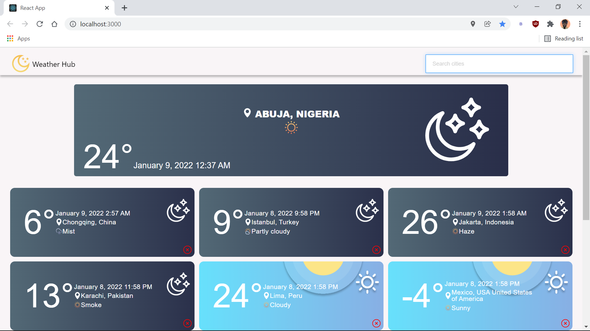
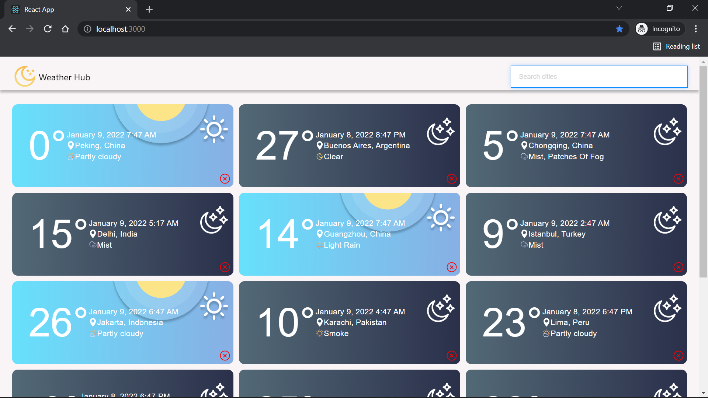
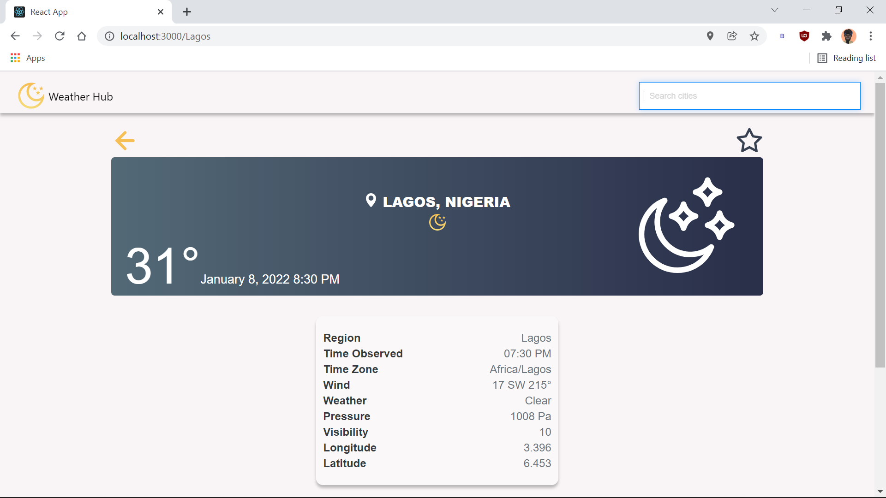
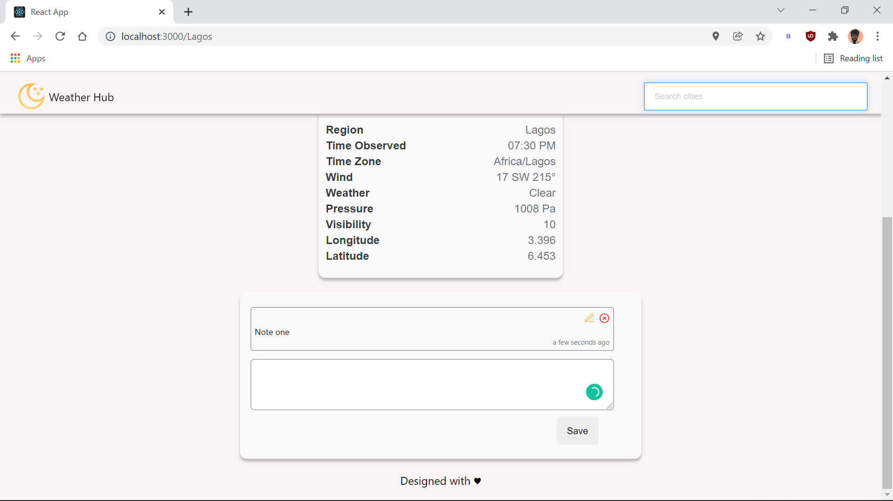
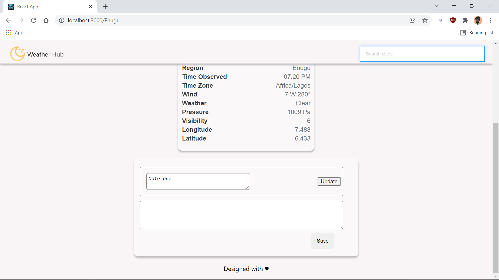

# DEEP CONSULTING ASSESSMENT SOLUTION :tada:

## Documentation 

:fire:[Live Link](https://deep-learning-consulting.netlify.app) :fire:
## Installation
If you want to contribute or just want to run the project on your local machine, follow the steps below.

Clone the repository:
```bash
    $ git clone https://github.com/LogicalOgbonna/deep-consulting-interview.git 
```
Install dependencies:
```bash
    $ yarn install or npm install
```

## Development
To run the web application run the command:
```bash
    $ yarn start or npm start
```

## Build
To build the the project run the command:
```bash
    $ yarn build or npm run build
```

## Screenshots
Home Page Screenshots



Home Page with location access denied


<br>
Search Result





Edit Note
